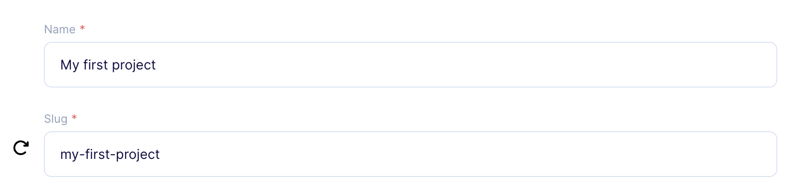
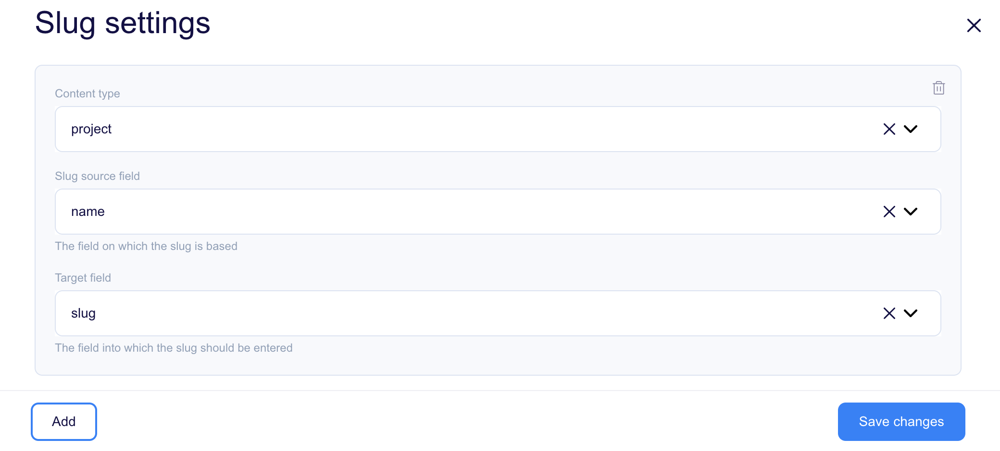

# About plugin

This plugin simplifies the process of creating slugs for your Content Object. It’s particularly useful when you want to generate slugs automatically based on existing data within a Content Object (e.g. the title of a blog post).

## Plugin outcome

In the Content Object form, look for the refresh icon next to the slug field. If you’re creating a new object and the field is currently empty, it will be auto-filled. If you’re editing an existing object or the field contains data, click the refresh icon to regenerate the slug.



## Configuring plugin

To manage a plugin, you must first add it to your plugins. Click the "+" icon to add the plugin to your library and click the "Manage" button. It will open the plugin settings.



Field descriptions: 

* `Content Type` - Defines the type of objects for which the slug will be generated.
* `Key` - Determines the field on which the slug will be based.
* `Label` - Specifies the field to which the slug will be entered.

# Development

## Quickstart:

1. `yarn`
2. `yarn start`
3. work work work
4. update your `src/plugin-manifest.json` file to contain the production URL and other plugin information
5. `yarn build`
6. paste js code from `./build/static/js/main.xxxxxxxx.js` to Flotiq console
7. navigate to affected Flotiq pages

## Deployment

<!-- TO DO -->

## Loading the plugin

### URL

1. Open Flotiq editor
2. Open Chrome Dev console
3. Execute the following script
   ```javascript
   FlotiqPlugins.loadPlugin('plugin-id', '<URL TO COMPILED JS>')
   ```
4. Navigate to the view that is modified by the plugin

### Directly

1. Open Flotiq editor
2. Open Chrome Dev console
3. Paste the content of `static/js/main.xxxxxxxx.js` 
4. Navigate to the view that is modified by the plugin

### Deployment

<!-- TO DO fix react dev cors -->

1. Open Flotiq editor
2. Add a new plugin and paste the URL to the hosted `plugin-manifest.json` file (unfortunately you cannot use `https://localhost:3050/plugin-manifest.json` due to CORS issues in the react dev server )
3. Navigate to the view that is modified by the plugin